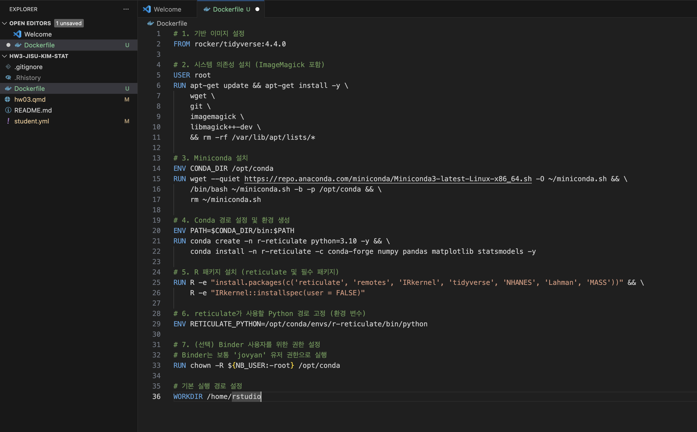
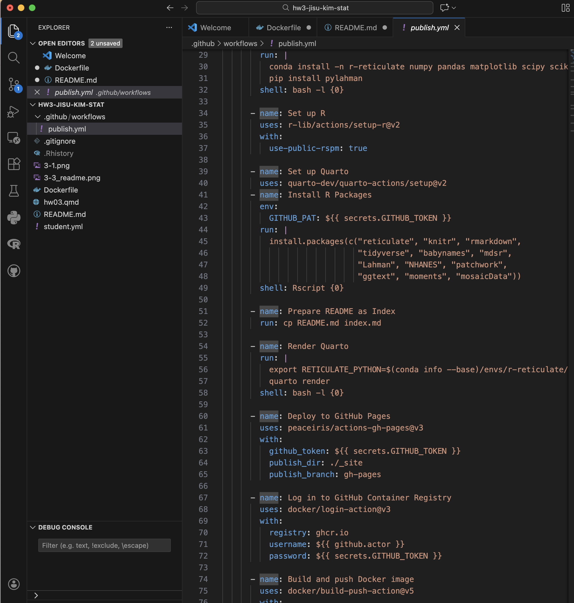
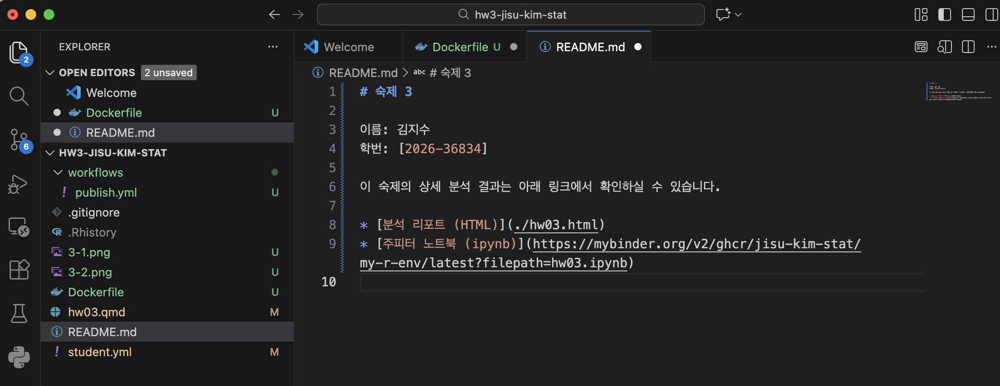
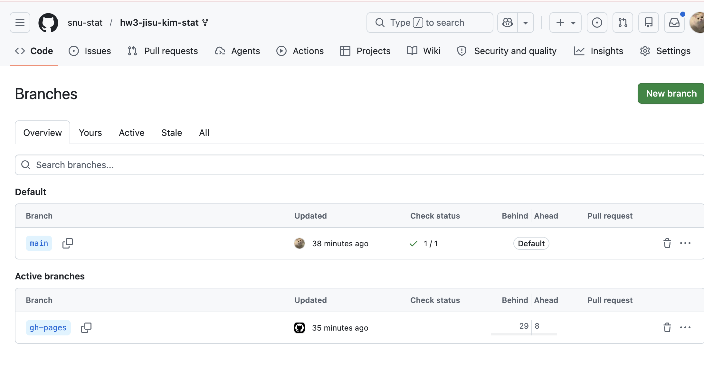
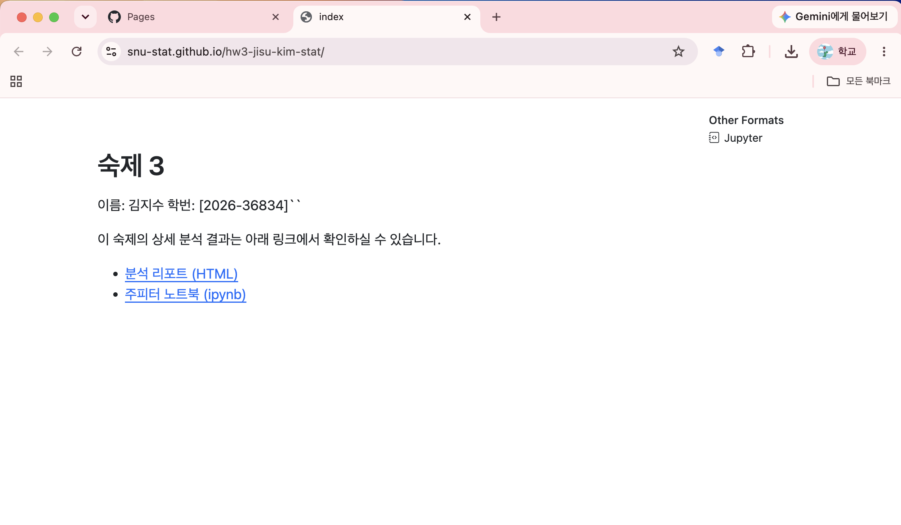
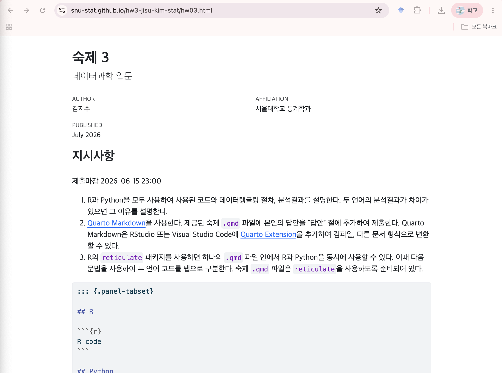

```{r setup, include=FALSE}
knitr::opts_chunk$set(echo = TRUE, eval = TRUE, warning = FALSE, message = FALSE, fig.width=6, fig.height=4, out.width = "70%", fig.align = "center", python.reticulate = TRUE)  
options(knitr.table.format = "html")
if (file.exists("/Users/jisukim/miniconda3/bin/conda")) {
  reticulate::use_condaenv(condaenv = "introds", conda = "/Users/jisukim/miniconda3/bin/conda")
} else {
  reticulate::use_python(Sys.which("python3"))
}
```

## 지시사항

제출마감 2026-06-15 23:00

1.	R과 Python을 모두 사용하여 사용된 코드와 데이터랭글링 절차, 분석결과를 설명한다. 두 언어의 분석결과가 차이가 있으면 그 이유를 설명한다.
2.  [Quarto Markdown](https://quarto.org/docs/authoring/markdown-basics.html)을 사용한다. 제공된 숙제 `.qmd` 파일에 본인의 답안을 "답안" 절에 추가하여 제출한다. Quarto Markdown은 RStudio 또는 Visual Studio Code에 [Quarto Extension](https://marketplace.visualstudio.com/items?itemName=quarto.quarto)을 추가하여 컴파일, 다른 문서 형식으로 변환할 수 있다. 
3.  R의 `reticulate` 패키지를 사용하면 하나의 `.qmd` 파일 안에서 R과 Python을 동시에 사용할 수 있다. 이때 다음 문법을 사용하여 두 언어 코드를 탭으로 구분한다.  숙제 `.qmd` 파일은 `reticulate`을 사용하도록 준비되어 있다.

````
::: {.panel-tabset}

## R

```{{r}}
R code
```

## Python

```{{python}}
Python code
```

:::

````

3.  `.qmd`를 컴파일하여 생성된 `.html` 파일을 함께 저장소에 제출한다.
4.  함께 제공된 `student.yml`을 함께 작성하여 저장소에 제출한다.

## 평가 기준

1.  재현성: 제출된 저장소의 `.qmd` 파일을 컴파일하여 함께 제출된 `.html` 파일과 동일한 결과가 나와야 한다.
2.	분석의 정확성: 분석은 올바른 기술적 세부 사항을 포함하여 수행되어야 한다.
3.	보고서의 전반적인 품질: 데이터 가공 및 분석 결과가 명확하고 자세하게 설명되어야 한다.
4.	코드의 전반적인 품질: 코드는 체계적으로 정리되어 있어야 하며, 가독성을 높이기 위해 적절한 주석이 포함되어야 한다.

#### **늦게 제출된 과제물은 받지 않는다.**

# 1부  교과서 연습문제

## 문제 1-1

1. MDSR 10장 연습문제 10.6.6

### 답안
SmokeNow 변수는 담배를 100개비 이상 피운 사람에 대해서만 yes/no를 기록하고 있고, 한 번도 담배를 피우지 않은 사람에 대해서 'NA'로 기록되어 있다. 따라서 현재 흡연 여부인 'smoke' 변수를 다음과 같이 recode한다. 

- 'SmokeNow == "Yes"' 이면 1
- 'SmokeNow == "No"' 또는 'SmokeNow == NA'이면 0 


::: {.panel-tabset}

## R

```{r}
library(tidyverse)
library(NHANES)

# 데이터 전처리 
nhanes_adult <- NHANES |>
  filter(Age >= 20) |>
  mutate(
    smoke = case_when(
      SmokeNow == "Yes" ~ 1L,
      SmokeNow == "No"  ~ 0L,
      Smoke100 == "No"  ~ 0L,   
      TRUE              ~ NA_integer_
    )
  ) |>
  filter(!is.na(smoke)) |>
  select(smoke, Age, Gender, Race1, Education, BMI, Depressed)

# 모델 적합 
fit_r <- glm(smoke ~ Age + Gender + Race1 + Education + BMI + Depressed,
             data   = nhanes_adult,
             family = binomial)

summary(fit_r)
```

## Python

```{python}
import pandas as pd
import numpy as np
import statsmodels.formula.api as smf

# 데이터 불러오기 
nhanes = r.nhanes_adult.copy()

# 데이터 전처리 (결측치 제거)
nhanes = nhanes.dropna(subset=['smoke', 'Age', 'Gender', 'Race1', 
                                      'Education', 'BMI', 'Depressed'])

nhanes['Race1'] = pd.Categorical(nhanes['Race1'], categories=['Black','Hispanic','Mexican','White','Other'])

nhanes['Education'] = pd.Categorical(nhanes['Education'],
categories=['8th Grade','9 - 11th Grade','High School','Some College','College Grad'])

nhanes['Depressed'] = pd.Categorical(nhanes['Depressed'],
categories=['None','Several','Most'])


# 모델 적합 
fit_py = smf.logit(
    "smoke ~ Age + Gender + Race1 + Education + BMI + Depressed",
    data = nhanes
).fit()

print(fit_py.summary())
```

:::

예측변수로는 Age, Gender, Race, Education, BMI, Depressed를 사용하였다. 로지스틱 회귀분석 결과, 나이가 많을수록, 교육 수준이 높을수록, BMI가 높을수록 현재 흡연할 확률이 유의하게 낮았다. 반면 남성이 여성보다, 그리고 우울감(Depressed)이 있을수록 흡연 확률이 유의하게 높았다. 인종의 경우 Black을 기준으로 Hispanic과 Mexican이 유의하게 낮은 흡연 확률을 보였으나, White, Other는 유의한 차이가 없었다. 

# 2부  데이터 분석 실무

### 분석 관련 공통 지침

1.	관측단위(observational unit)는 `playerID`와 `yearID`의 고유한 조합으로 한다. 즉, 데이터프레임의 각 행은 한 선수의 특정 연도에 해당해야 하고(예: 2019년 류현진), 한 선수의 특정 연도가 두 번 이상 나타나서는 안 된다. 이적을 한 경우 원자료에서는 두 번 이상 나타날 수 있으므로 주의해야 한다.
2.	데이터 분석을 하는 중에 필요한 경우 pivoting으로 각 행이 한명의 선수에 해당하는 wide format data를 만들어서 연도간 비교를 하는 것은 허용한다.


## 문제 2-1

Lahman Package의 `Teams` 데이터프레임에서 코로나 시즌인 2020년을 제외한 2010년부터 2025년 사이의 데이터를 이용하여 다음 질문에 답하라. 

1.  MDSR Chapter 7 Iteration 에서 배운 Bill James의 공식을 변형한 다음 모형을 데이터에 적합하고, 모수 $k$의 점추정치와 신뢰구간을 구하라.
$$
  WPct = \frac{RS^k}{S^k+RA^k} = \frac{1}{1+(RA/RS)^k}
$$

2.  회귀계수 $\beta_1$이 위 모형의 $k$와 거의 같은 의미를 가지는 로지스틱 회귀 모형을 세우고 이를 데이터에 적합하라. 모수와 점추정치와 신뢰구간을 구하고 이를 1항의 결과와 비교하라. 

    *주의*: 절편이 없는 모형을 적합해야 함.
    *힌트 1*. 로짓은 $\log〖WPct/(1-WPct)$로 계산됨.
    *힌트 2*. 로짓의 역함수인 sigmoid는 $\frac{1}{1+e^{-x}}$로 계산됨.

3.  2항의 모형 적합 결과에 대한 다음 세가지 진단 중 최소 두가지 이상을 수행하여 모형적합이 잘 되었는지 확인하라.

    i.  Residual Deviance에 대한 해석 (카이제곱 분포와 비교) 
	  ii. Deviance residuals vs linear predictors ($\eta$) 산점도 
	  iii.  관측된 WPct와 모형에서 예측하는 WPct를 산점도 그래프로 비교

4.  `WPct`를 반응변수로, `log(RA)`와 `log(RS)`를 설명변수로 하는 절편이 없는 로지스틱선형회귀 모형을 적합하고 회귀계수들의 추정 결과를 a와 b항의 결과와 비교하라. (유사한 모형을 얻는지 여부 등)


### 답안

1. 
주어진 공식의 양변에 로짓 변환을 취하면 기울기가 k이고 절편이 없는 단순선형회귀로 표현할 수 있는데, RS = RA일 때 WPct = 0.5, 즉 로짓값이 0이 되어 절편이 0임을 알 수 있다. 따라서 절편 없는 단순선형회귀를 이용해 k를 추정한다. 아래 코드를 통해 점추정치는 1.759이고 95% 신뢰구간은 [1.703, 1.815]임을 알 수 있다.

::: {.panel-tabset}

## R

```{r}
library(tidyverse)
library(Lahman)

# 데이터 불러오기 및 전처리 
teams <- Teams |>
  filter(yearID >= 2010, yearID <= 2025, yearID != 2020) |>
  mutate(
    WPct = W / (W + L),
    logit_WPct = log(WPct / (1 - WPct)),
    log_RS_RA  = log(R / RA)
  ) |>
  filter(is.finite(logit_WPct), is.finite(log_RS_RA))

# 모델 적합 
fit_r <- lm(logit_WPct ~ 0 + log_RS_RA, data = teams)
summary(fit_r) # 점추정치 
confint(fit_r) #신뢰구간
```
## Python

```{python}
import pandas as pd
import numpy as np
import statsmodels.formula.api as smf

# 데이터 불러오기 
teams_py = r.teams.copy()

# 모델 적합 
fit_py = smf.ols("logit_WPct ~ 0 + log_RS_RA", data = teams_py).fit()
print(fit_py.summary())
print(fit_py.conf_int())
```
:::

2.
로지스틱 회귀모형을 적합하고, WPct를 반응변수로 사용한다. 이때 로짓의 역함수인 시그모이드 값이 WPct와 같으므로, link function이 logit인 binomial GLM을 사용하면 $\beta_1$이 1번문제의 $k$와 같은 역할을 한다. 즉 모형을 다음과 같이 세운다. 
$$
logit(WPct) = \beta_1 \cdot \log (\frac{RS}{RA})
$$

이때 WPct는 G번 시행한 이항 비율로 볼 수 있고, 이항 비율의 분산은 총 경기수 G에 반비례한다. 즉 경기수가 많을수록 더 안정적인 추정치가 된다. 따라서 weight로 경기 수인 G = W+L을 사용한다. 이렇게 적합한 결과 점추정치는 1.753, 95% 신뢰구간은 [1.664, 1.843]이다. 1번의 결과(k = 1.759, [1.703, 1.815])와 점추정치는 유사하나 신뢰구간이 다소 넓은데, 이는 GLM이 경기 수에 따른 분산 구조를 반영하기 때문이다.

::: {.panel-tabset}

## R
```{r}
teams <- teams |> mutate(G = W + L)

fit2_r <- glm(WPct ~ 0 + log_RS_RA,
              family  = binomial,
              weights = G,
              data    = teams)

summary(fit2_r) #점추정치
confint(fit2_r) #신뢰구간 
```

## Python
```{python}
import statsmodels.api as sm

# 반응변수 
teams_py = r.teams.copy()

fit2_py = smf.glm("WPct ~ 0 + log_RS_RA",
                  data    = teams_py,
                  family  = sm.families.Binomial(),
                  freq_weights = teams_py['G']).fit()

print(fit2_py.summary())
print(fit2_py.conf_int())
```
:::

3. 
(i) : residual deviance = 180.2632로 자유도 449보다 훨씬작고, 카이제곱 분포와 비교한 p-value = 1로 모형이 데이터에 잘 적합되었음을 보여준다. 이는 MLB팀의 승률이 대부분 0.4~0.6 사이에 집중되어있어 변동이 작고, RS/RA가 이를 잘 설명하기 때문이다. 

(ii) : 산점도에서 잔차가 0을 중심으로 랜덤하게 퍼져있고, 특별한 패턴은 보이지 않는다. 대부분 -2~2 사이에 위치하고 있으며, 이는 모형이 데이터의 패턴을 잘 포착했음을 의미한다.

(iii) : 대부분의 점이 y=x 근처에 몰려있어 모형의 예측과 실제값이 대부분 비슷함을 알 수 있다. 다만 일부 극단적인 값에서는 기준선에서 벗어나는 경향이 보이는데, 극단적인 성적을 가진 팀에서는 예측의 정확도가 다소 낮아짐을 알 수 있다. 

::: {.panel-tabset}

## R
```{r}
# i. Residual Deviance 카이제곱 분포와 비교
deviance(fit2_r)
df.residual(fit2_r)
pchisq(deviance(fit2_r), df = df.residual(fit2_r), lower.tail = FALSE)

# ii. Deviance residuals vs linear predictors 산점도
plot(predict(fit2_r, type = "link"),
     residuals(fit2_r, type = "deviance"),
     xlab = expression(hat(eta)),
     ylab = "Deviance Residuals",
     main = "Deviance Residuals vs Linear Predictors")
abline(h = 0, lty = 2, col = "red")

# iii. 관측 WPct vs 예측 WPct 산점도
teams <- teams |>
  mutate(WPct_pred = predict(fit2_r, type = "response"))

ggplot(teams, aes(x = WPct_pred, y = WPct)) +
  geom_point(alpha = 0.5) +
  geom_abline(slope = 1, intercept = 0, col = "red", lty = 2) +
  labs(x = "Predict", y = "Observed",
       title = "Observed WPct vs Predicted WPct")
```

## Python
```{python}
import matplotlib.pyplot as plt
import statsmodels.api as sm
from scipy import stats

# 데이터 불러오기 
teams_py = r.teams.copy()

# i. Residual Deviance 카이제곱 분포와 비교
deviance = fit2_py.deviance
df_resid = fit2_py.df_resid
p_value = stats.chi2.sf(deviance, df_resid)
print(f"Residual Deviance: {deviance:.3f}, df: {df_resid}, p-value: {p_value:.4f}")

# ii. Deviance residuals vs linear predictors 산점도
fig, axes = plt.subplots(1, 2, figsize=(12, 5)) # 두 그래프 한번에 그리기 

axes[0].scatter(fit2_py.predict(linear=True),
                fit2_py.resid_deviance, alpha=0.5)
axes[0].axhline(0, color='red', linestyle='--')
axes[0].set_xlabel(r'$\hat{\eta}$')
axes[0].set_ylabel('Deviance Residuals')
axes[0].set_title('Deviance Residuals vs Linear Predictors')

# iii. 관측 WPct vs 예측 WPct 산점도
axes[1].scatter(fit2_py.predict(), teams_py['WPct'], alpha=0.5)
axes[1].plot([0.3, 0.7], [0.3, 0.7], 'r--')
axes[1].set_xlabel('Observed WPct')
axes[1].set_ylabel('Predict WPct')
axes[1].set_title('Observed WPct vs Predict WPct')

plt.tight_layout()
plt.show()
```

:::


4.
앞선 모델에서는 log(RS/RA) = log(RS) - log(RA)를 하나의 설명변수로 사용하였는데, 여기서는 각각을 따로 설명변수로 사용한다. 만약 두 모형이 유사하다면 log(RS)의 계수가 +k, log(RA)의 계수가 -k로 추정되어야 한다. 그리고 두 회귀계수의 절댓값이 비슷하면 2번문제의 모형과 유사함을 알 수 있다. 참고로 2번문제에서는 $\hat \beta_1$ =  1.753이었다. 

적합 결과 log(RS)의 추정 계수는 1.753, log(RA)의 추정 계수는 -1.754로 부호가 반대이고 절댓값이 거의 동일하다. 2번 문제의 $\hat \beta_1$과도 일치하므로, log(RS/RA)를 단일 설명변수로 사용한 모형과 실질적으로 동등한 모형임을 확인할 수 있다.


::: {.panel-tabset}

## R
```{r}
fit3_r <- glm(WPct ~ 0 + log(R) + log(RA),
              family  = binomial,
              weights = G,
              data    = teams)

summary(fit3_r)
```

## Python
```{python}
import numpy as np

teams_py['log_R']  = np.log(teams_py['R'])
teams_py['log_RA'] = np.log(teams_py['RA'])

fit3_py = smf.glm("WPct ~ 0 + log_R + log_RA",
                  data         = teams_py,
                  family       = sm.families.Binomial(),
                  freq_weights = teams_py['G']).fit()

print(fit3_py.summary())
```

:::

## 문제 2-2

`WPct`를 반응변수로, `logRS`, `logRA`, `H`, `X2B`, `X3B`, `HR`, `BB`, `SO`, `CS`, `HBP`, `SF`, `ERA`, `CG`, `SHO`, `IPouts`, `HA`, `HRA`, `BBA`, `SOA`, `E`, `DP`, `FP`, `SV`를 설명변수로 하는 절편항이 있는 로지스틱 회귀 모형을 적합하고 AIC를 기준으로 하는 단계별(stepwise) 변수선택을 적용하라. 변수선택 후 남은 변수들을 모두 모형에 남길지 일부를 제거할지 다시 판단하라. 최종적으로 선택된 모형을 문제1의 모형과 비교하라. 

### 답안
stepwise 변수선택 후에도 CG (p = 0.129), SHO (p = 0.065)의 p-value > 0.05이므로 이들을 제거하고 다시 모형을 적합한다. 제거 후 AIC를 비교하여 최종 모형을 선택한다. CG, SHO 제거 후 최종 모형은 logRS + logRA + SV로, 모든 변수가 유의수준 0.05에서 유의하다. stepwise 모형(AIC = 2601.4)과 AIC 차이가 2.16으로 매우 작으므로 더 단순한 최종 모형을 선택한다.

문제 1의 모형(AIC = 2665.5)과 비교하면 최종 모형의 AIC가 더 낮아 적합한 모델이다. 특히 SV가 추가됨으로써 예측력이 높아졌는데, 이는 마무리 투수의 역할이 승률에 유의한 영향을 미침을 나타낸다. 다만 문제 1의 모형은 변수가 단 하나(log(RS/RA))로 해석이 훨씬 간단하다는 장점이 있다.

Python에서는 statsmodels가 stepwise 변수선택을 지원하지 않으므로, R의 stepAIC 결과에서 최종 선택된 변수(logRS, logRA, SV)를 그대로 사용하여 동일한 모형을 적합하였다.

::: {.panel-tabset}

## R
```{r}
library(MASS)

# 데이터 전처리 
teams <- teams |>
  mutate(
    logRS = log(R),
    logRA = log(RA)
  )

# Full model 적합 
fit_full <- glm(WPct ~ logRS + logRA + H + X2B + X3B + HR + BB + SO + 
                  CS + HBP + SF + ERA + CG + SHO + IPouts + HA + HRA + 
                  BBA + SOA + E + DP + FP + SV,
                family  = binomial,
                weights = G,
                data    = teams)

# AIC 기준 stepwise 변수선택 
fit_step <- stepAIC(fit_full, direction = "both", trace = FALSE)

summary(fit_step)

# 유의하지 않은 변수 제거 후 다시 모델 적합 
fit_final <- glm(WPct ~ logRS + logRA + SV,
                 family  = binomial,
                 weights = G,
                 data    = teams)

summary(fit_final)
AIC(fit_step, fit_final) 

# 문제 1의 모형과 비교 
AIC(fit2_r, fit_final)
```


## Python
```{python}

# 데이터 불러오기 
teams_py['logRS'] = np.log(teams_py['R'])
teams_py['logRA'] = np.log(teams_py['RA'])

# R stepwise 결과와 동일한 변수로 모델 적합
fit_final_py = smf.glm("WPct ~ logRS + logRA + SV",
                       data         = teams_py,
                       family       = sm.families.Binomial(),
                       freq_weights = teams_py['G']).fit()

print(fit_final_py.summary())
```

:::

## 문제 2-3

1.  `W`(승리 횟수)를 반응변수로 하여 문제 2-2의 분석을 실시하되 포아송 회귀모형을 사용하라. 결과를 문제 2-2의 모형과 비교하라. 

2.  `W`를 반응변수로 하여 문제2의 분석을 실시하되 음이항 회귀모형을 사용하라. 모형 적합 시 오류가 발생하면 이유를 파악해서 보고하라.

### 답안
1. 승리 횟수 W는 경기당 평균 승리 횟수이며, 경기 수인 G에 비례한다. 따라서 offset(log(G))를 추가하여 경기 수 차이를 보정한다. 즉, 모형은 다음과 같다. 
$$
log(E[W]) = \beta_0 + \beta_1 \cdot \log(RS) + \beta_2 \cdot \log(RA) + \ldots + \log(G)
$$
이는 다음과 동치이다. 
$$
log(E[W]/G) = \beta_0 + \beta_1 \cdot \log(RS) + \beta_2 \cdot \log(RA) + \ldots 
$$
문제 2-2에서 주어진 변수들을 이용해 stepwise 변수선택을 적용하고 최종 모델을 적합한다. stepwise 결과 logRS, ERA, CG, SHO, FP, SV가 선택되었으나, CG (p = 0.156), SHO (p = 0.152), FP (p = 0.148)가 유의하지 않아 이를 제거하고 logRS, ERA, SV를 최종 변수로 선택하였다. stepwise 모형(AIC = 2874.3)과 최종 모형(AIC = 2875.3)의 AIC 차이가 약 1로 매우 작으므로 더 단순한 최종 모형을 선택한다.

문제 2-2의 binomial GLM과 비교하면, binomial은 실점을 logRA로, 포아송은 ERA로 포착한 점이 다르다. 두 모형 모두 SV가 공통으로 선택되어 마무리 투수의 역할이 승리에 유의한 영향을 미침을 일관되게 보여준다. 한편, 반응변수의 스케일이 다르므로(WPct vs W) AIC 직접 비교는 적절하지 않다.

앞선 문제 2-2와 마찬가지로 Python의 경우 statsmodels가 stepwise 변수선택을 지원하지 않으므로, R의 stepAIC 결과에서 최종 선택된 변수(logRS, ERA, SV)를 그대로 사용하여 동일한 모형을 적합하였다.

::: {.panel-tabset}

## R
```{r}
teams <- teams |> mutate(G = W + L)

# full 모형 적합 
fit_pois_full <- glm(W ~ logRS + logRA + H + X2B + X3B + HR + BB + SO +
                       CS + HBP + SF + ERA + CG + SHO + IPouts + HA + HRA +
                       BBA + SOA + E + DP + FP + SV + offset(log(G)),
                     family = poisson,
                     data   = teams)

# AIC 기준 stepwise 변수선택 
fit_pois_step <- stepAIC(fit_pois_full, direction = "both", trace = FALSE)
summary(fit_pois_step)

# 유의하지 않은 변수 제거 후 최종 모델 적합
fit_pois_final <- glm(W ~ logRS + ERA + SV + offset(log(G)),
                      family = poisson,
                      data   = teams)
summary(fit_pois_final)
AIC(fit_pois_step, fit_pois_final)
```

## Python
```{python}
teams_py['logRS'] = np.log(teams_py['R'])

# R stepwise 결과와 동일한 변수 사용 
fit_pois_final_py = smf.glm("W ~ logRS + ERA + SV",
                             data   = teams_py,
                             family = sm.families.Poisson(),
                             offset = np.log(teams_py['G'])).fit()

print(fit_pois_final_py.summary())
```

:::

2. 
R에서는 glm.nb가 $\theta$를 데이터로부터 직접 추정하여, 음이항 회귀모형 적합 시 분산 $\theta = 9,999,512$ 로 사실상 무한대로 발산하였고, iteration limit reached 경고가 발생하였다. 즉 $\theta$의 MLE가 존재하지 않음을 의미한다.
Python에서는 statsmodels.discrete의 NegativeBinomial을 사용하여 $\alpha = 1/\theta$를 직접 추정하였다. 그 결과 ConvergenceWarning이 발생하였으며, 추정된 $\hat{\alpha} = 5.08 \times 10^{-9} \approx 0$으로 $\theta \to \infty$와 동일한 결과이다.

이와 같은 경고가 발생하는 이유는 다음과 같다. 음이항 분포의 log-likelihood는
$$\ell(\theta) = \sum_{i=1}^n \left[ \log\Gamma(y_i + \theta) - \log\Gamma(\theta) + \theta\log\theta - \theta\log(\theta + \mu_i) + y_i\log\mu_i - y_i\log(\theta+\mu_i) \right]$$
이다. 
이를 $\theta$에 대해 미분하면, 
$$\frac{\partial \ell}{\partial \theta} = \sum_{i=1}^n \left[ \psi(y_i + \theta) - \psi(\theta) + \log\theta + 1 - \log(\theta+\mu_i) - \frac{\theta+y_i}{\theta+\mu_i} \right]$$

여기서 $\psi$는 digamma function이다.

데이터의 실제 분산이 $\approx \mu$ 이면 $\frac{\partial \ell}{\partial \theta} > 0$ for all $\theta$가 성립하고, 따라서 $\theta$가 커질수록 likelihood가 단조 증가하므로 유한한 MLE가 존재하지 않아 알고리즘이 수렴하지 못한다.


::: {.panel-tabset}
## R
```{r}
library(MASS)

# Full 모델 적합 
fit_nb_full <- glm.nb(W ~ logRS + logRA + H + X2B + X3B + HR + BB + SO +
                        CS + HBP + SF + ERA + CG + SHO + IPouts + HA + HRA +
                        BBA + SOA + E + DP + FP + SV + offset(log(G)),
                      data = teams)

# AIC 기준 stepwise 변수선택 
fit_nb_step <- stepAIC(fit_nb_full, direction = "both", trace = FALSE)
summary(fit_nb_step)
```

## Python
```{python}
import statsmodels.discrete.discrete_model as dm

fit_nb_py2 = dm.NegativeBinomial.from_formula(
    "W ~ logRS + ERA + CG + SHO + FP + SV",
    data   = teams_py,
    offset = np.log(teams_py['G'])
).fit()
print(fit_nb_py2.summary())
```

:::


## 문제 2-4

스테로이드 시대인 1994년에서 2005년의 기간과 최근 시대인 2010년에서 2025 기간의 $k$ 계수가 유의하게 변화하는지 파악하기 위해 $i$번째 팀과 연도 $t$에 대해 다음과 같은 식을 생각해 볼 수 있다.
$$
  WPct_(i,t)
  =
  \frac{1}{1+(RA_{i,t}/RS_{i,t} )^{k+g I(1994 \leq t \leq 2005)} }
$$
이 때 $I(1994 \leq t \leq 2005)$는 괄호안의 조건이 만족되면 1의 값을 가지고 아니면 0의 값을 가지는 지시함수이고, $g$는 스테로이드 시대와 최근 시대의 차이를 나타내는 계수이다. 위의 식에서 $g$가 0과 유의하게 같은지 가설검정을 수행하게 해주는 로지스틱 모형을 적합하고 결과를 해석하라. (코로나 시즌인 2020년은 제외한다.)


### 답안
주어진 모형에 로짓 변환을 취하면 다음과 같다. 
$$
\text{logit}(\text{WPct}_{i,t}) = (k + g \cdot I(1994 \leq t \leq 2005)) \cdot \log\left(\frac{RS_{i,t}}{RA_{i,t}}\right)
$$
즉 시대별로 표현하면 :
- 최근 시대 ($I = 0$): $\text{logit}(\text{WPct}) = k \cdot \log(RS/RA)$
- 스테로이드 시대 ($I = 1$): $\text{logit}(\text{WPct}) = (k+g) \cdot \log(RS/RA)$

이는 $\log(RS/RA)$와 $\log(RS/RA) \times I(1994 \leq t \leq 2005)$의 상호작용 항을 포함하는 절편 없는 로지스틱 회귀모형으로 표현된다. 여기서 $k$는 최근 시대의 계수, $g$는 스테로이드 시대와 최근 시대의 차이를 나타내는 계수이다.

$g$가 0과 유의하게 다른지 검정하기 위해 $H_0: g = 0$ vs $H_1: g \neq 0$을 수행한다.

적합 결과,  $\hat{k} = 1.753$ (p < .001), $\hat{g} = 0.162$ (p = 0.031)로 $g$가 유의수준 0.05에서 유의하게 0과 다르다. 즉 $H_0: g = 0$을 기각한다.

스테로이드 시대의 계수는 $\hat{k} + \hat{g} = 1.753 + 0.162 = 1.915$로 최근 시대의 $\hat{k} = 1.753$보다 크다. 이는 스테로이드 시대에는 득실점 비율이 승률에 더 큰 영향을 주었음을 의미한다. 

::: {.panel-tabset}
## R
```{r}
# 스테로이드 시대와 최근 시대 데이터 합치기 
teams_both <- Teams |>
  filter((yearID >= 1994 & yearID <= 2005) | 
         (yearID >= 2010 & yearID <= 2025 & yearID != 2020)) |>
  mutate(
    WPct      = W / (W + L),
    G         = W + L,
    log_RS_RA = log(R / RA),
    steroid   = ifelse(yearID >= 1994 & yearID <= 2005, 1, 0)
  ) |>
  filter(is.finite(WPct), is.finite(log_RS_RA))

# 모형 적합 
fit_interact <- glm(WPct ~ 0 + log_RS_RA + I(log_RS_RA * steroid),
                    family  = binomial,
                    weights = G,
                    data    = teams_both)

summary(fit_interact)
```

## Python
```{python}
# 데이터 불러오기
teams_both_py = r.teams_both.copy()

# 모델 적합 
fit_interact_py = smf.glm(
    "WPct ~ 0 + log_RS_RA + I(log_RS_RA * steroid)",
    data         = teams_both_py,
    family       = sm.families.Binomial(),
    freq_weights = teams_both_py['G']
).fit()

print(fit_interact_py.summary())
```

:::


# 3부  데이터 분석 기술

숙제 2에서는 제출용 GitHub 저장소에 작업한 Quarto markdown 소스 파일(`hw02.qmd`)을 올리면 GitHub에서 자동으로 HTML 파일 및 주피터 노트북 파일(`.ipynb`)을 만들고 이것을 [GitHub Pages](https://docs.github.com/en/pages/quickstart)에서 웹페이지로 보이도록 설정하였다. 
여기서는 숙제 3 제출용 GibHub 저장소에 작업한 Quarto markdown 소스 파일(`hw03.qmd`)을 올리면 숙제 2에서의 작업 프로세스에 더해 자동 생성된 `.ipynb` 파일을 컨테이너화하여, GitHub에서 자동 생성된 컨테이너 이미지를 Binder 서비스를 이용하여 온라인에서 주피터 노트북 파일을 사용할 수 있도록 한다.

## 문제 3-1. Dockerfile 설정

로컬 저장소 최상위 디렉토리에 아래와 같은 `Dockerfile` 파일을 추가한다. 
```{yml}
# 1. 기반 이미지 설정
FROM rocker/tidyverse:4.4.0

# 2. 시스템 의존성 설치 (ImageMagick 포함)
USER root
RUN apt-get update && apt-get install -y \
    wget \
    git \
    imagemagick \
    libmagick++-dev \
    && rm -rf /var/lib/apt/lists/*

# 3. Miniconda 설치
ENV CONDA_DIR /opt/conda
RUN wget --quiet https://repo.anaconda.com/miniconda/Miniconda3-latest-Linux-x86_64.sh -O ~/miniconda.sh && \
    /bin/bash ~/miniconda.sh -b -p /opt/conda && \
    rm ~/miniconda.sh

# 4. Conda 경로 설정 및 환경 생성
ENV PATH=$CONDA_DIR/bin:$PATH
RUN conda create -n r-reticulate python=3.10 -y && \
    conda install -n r-reticulate -c conda-forge numpy pandas matplotlib -y
# 추가로 필요한 패키지 설치

# 5. R 패키지 설치 (reticulate 및 필수 패키지)
RUN R -e "install.packages(c('reticulate', 'remotes', 'IRkernel'))" && \
    R -e "IRkernel::installspec(user = FALSE)"
# 추가로 필요한 패키지 설치

# 6. reticulate가 사용할 Python 경로 고정 (환경 변수)
ENV RETICULATE_PYTHON=/opt/conda/envs/r-reticulate/bin/python

# 7. (선택) Binder 사용자를 위한 권한 설정
# Binder는 보통 'jovyan' 유저 권한으로 실행
RUN chown -R ${NB_USER:-root} /opt/conda

# 기본 실행 경로 설정
WORKDIR /home/rstudio
```

### 답안
로컬 저장소 최상위 디렉토리에 `Dockerfile`을 추가하여 숙제 3 실행 환경을 컨테이너로 구성하였다. 기반 이미지는 R과 tidyverse가 포함된 `rocker/tidyverse:4.4.0`을 사용하였고, 분석에 필요한 시스템 패키지와 Miniconda를 설치하였다.

또한 reticulate에서 사용할 Python 환경을 만들고, 필요한 Python 패키지와 R 패키지를 함께 설치하였다. 마지막으로 `RETICULATE_PYTHON` 환경 변수를 설정하여 R에서 지정된 Python 환경을 사용하도록 하였으며, 기본 작업 디렉토리를 `/home/rstudio`로 지정하였다.

이를 통해 GitHub Actions에서 동일한 분석 환경을 가진 Docker 이미지를 빌드하고 GHCR에 업로드할 수 있도록 하였다.



## 문제 3-2. GitHub Actions 워크플로우 수정

숙제 2에서 만들었던 `publish.yml`을 수정하여 기존의 배포 단계 끝에 Docker 컨테이너 이미지를 빌드하고 Github Container Registry (GHCR)에 푸시하는 단계를 추가한다.

```{yml}
# ... (기존 Quarto Render 단계 이후)

      - name: Log in to GitHub Container Registry
        uses: docker/login-action@v3
        with:
          registry: ghcr.io
          username: ${{ github.actor }}
          password: ${{ secrets.GITHUB_TOKEN }}

      - name: Build and push Docker image
        uses: docker/build-push-action@v5
        with:
          context: .
          push: true
          tags: ghcr.io/${{ github.repository_owner }}/my-r-env:latest
```

### 답안
숙제 2에서 사용한 `publish.yml`을 수정하여 Docker 이미지 빌드와 GHCR push 단계를 추가하였다. Quarto 렌더링과 GitHub Pages 배포가 끝난 뒤, 현재 저장소를 기준으로 Docker 이미지를 빌드하고 `ghcr.io/jisu-kim-stat/my-r-env:latest`로 업로드하도록 설정하였다.

또한 새 과제 저장소에서는 기존 secret이 자동으로 전달되지 않았기 때문에, `CR_PAT` secret을 새로 등록하여 GHCR 로그인에 사용하였다. 이를 통해 GitHub Actions가 Quarto 결과물 생성, Pages 배포, Docker 이미지 빌드 및 GHCR push를 순서대로 수행하도록 구성하였다.



## 문제 3-3. GitHub Pages에 Binder 링크 추가

GitHub Page를 사용하여 저장소를 웹페이지로 활용하는 부분은 숙제 2에서와 같다.

웹페이지에서 노트북을 내려받는 대신 [Binder](mybinder.org) 서비스를 이용하여 온라인으로 노트북을 실행할 수 있도록 위해 `README.md` 파일을 로컬 저장소 최상위 디렉토리에 다음과 같이 만들자.

```{markdown}
# 숙제 3

이름: [아무개]
학번: [나의 학번]

이 숙제의 상세 분석 결과는 아래 링크에서 확인하실 수 있습니다.

* [분석 리포트 (HTML)](./hw03.html) 
* [주피터 노트북 (ipynb)](https://mybinder.org/v2/gh/snu-stat/hw3-2-jisu-kim-stat/gh-pages?filepath=hw03.ipynb)
```

여기서 `<유저명>`은 제출자의 GitHub 유저 아이디이다.

작업을 GitHub 원격 저장소로 push한 후 숙제 2 문제 3-3의 3, 4번 과정을 반복하라.

### 답안
먼저 저장소 최상위의 `README.md` 파일을 수정하였다. README에는 숙제 제목, 이름, 학번을 작성하고, 분석 리포트 HTML 파일과 Binder에서 실행할 수 있는 주피터 노트북 링크를 함께 추가하였다. Binder 링크는 `gh-pages` 브랜치에 배포된 `hw03.ipynb` 파일을 열도록 설정하였다.



이후 GitHub Actions가 실행되면서 Quarto 문서가 렌더링되고, GitHub Pages 배포용 `gh-pages` 브랜치가 생성된 것을 확인하였다. 이 브랜치에는 웹페이지로 배포될 HTML 파일과 Binder에서 사용할 `hw03.ipynb`, `requirements.txt`가 포함된다.



GitHub Pages 설정에서 배포 대상 브랜치를 `gh-pages`로 지정하였다. 이를 통해 `gh-pages` 브랜치에 있는 렌더링 결과물이 GitHub Pages 웹페이지로 공개되도록 설정하였다.


설정 후 GitHub Actions workflow가 정상적으로 종료되었는지 확인하였다. workflow에서는 Quarto 렌더링, `hw03.ipynb` 생성, Binder 실행 환경을 위한 `requirements.txt` 복사, GitHub Pages 배포가 순서대로 수행된다.


이후 GitHub Pages 주소에 접속하여 README 기반 웹페이지가 정상적으로 표시되는 것을 확인하였다. 웹페이지에는 분석 리포트 HTML 링크와 Binder 노트북 링크가 함께 나타난다.



마지막으로 웹페이지에서 링크들이 정상적으로 표시되는지 다시 확인하였다. 이를 통해 GitHub Pages 배포가 완료되었고, Binder를 통해 온라인에서 `hw03.ipynb` 노트북을 실행할 수 있도록 설정되었음을 확인하였다.



수정된 과제 안내에 따라 README의 Binder 링크를 `https://mybinder.org/v2/gh/snu-stat/hw3-2-jisu-kim-stat/gh-pages?filepath=hw03.ipynb` 형식으로 수정하였다.

수정 후 Binder가 저장소와 `gh-pages` 브랜치는 정상적으로 인식했지만, 실행 환경 명세 파일이 없어 `No environment specification found` 오류가 발생하였다. 이를 해결하기 위해 저장소 최상위에 `requirements.txt` 파일을 추가하고, 노트북 실행에 필요한 Python 패키지 목록을 작성하였다. 또한 GitHub Pages에는 `_site/` 디렉토리만 배포되므로, workflow에서 `requirements.txt`를 `_site/requirements.txt`로 복사하는 단계를 추가하였다.

최종적으로 GitHub Actions가 Quarto 문서를 렌더링하여 HTML과 `hw03.ipynb`를 생성하고, `requirements.txt`를 함께 `gh-pages` 브랜치에 배포하도록 설정하였다. 이를 통해 GitHub Pages 웹페이지에서 Binder 링크를 통해 온라인으로 `hw03.ipynb` 노트북을 실행할 수 있도록 구성하였다.